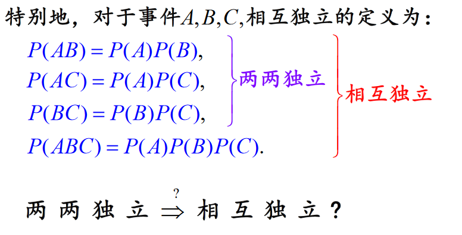

# 概率论与数理统计
+ 概率论是数学的一个分支，研究如何定量描述随机变量及其规律
+  数理统计则是以数据为唯一研究对象，包括数据的收集、整理、分析和建模，从而对随机现象的某些规律进行预测或决策。

## 概率论的学习
1. 学思想：如何看待和处理随机事件的规律性
2. 学方法：建立统计模型
3. 学应用：各种模型的应用
4. 学工具：利用excel、python等工具，对数据进行处理和分析

# 随机实验与样本空间
## 随机实验
### 定义
对随机现象的观察、记录、实验统称为随机试验。
### 特性
+ 在相同的条件下，可以重复实现
+ 事先知道所有可能出现的结果
+ 试验前并不知道哪个结果会发生
### 随机试验的分类
随机试验有很多种，例如常出现的掷骰子，摸球，射击，抛硬币等。所有的随机试验的结果可以分为两类来表示：
+ 数量化表示：射击命中的次数，商场每个小时的客流量，每天经过某个收费站的车辆等，这些结果本身就是数字；
+ 非数量化表示：抛硬币的结果（正面/反面），化验的结果（阳性/阴性）等，这些结果是定性的，非数量化的。但是可以用示性函数来表示，例如可以规定正面（阳性）为1，反面（阴性）为0，这样就实现了非数量化结果的数量化表示。

 

# 样本空间
+ 随机试验的所有可能结果构成的集合。一般即为S（大写的S）。
+ S中的元素e称为样本点（也可以叫做基本事件）；
+ 事件是样本空间的子集，同样是一个集合

# 事件的相互关系及运算

## 事件的关系


# 频率与概率
## 频率：
### 定义:
$$f_n(A) = \frac{n_A}{n}$$
其中：$n_A$是A 发生的次数(频数)  
n是总的试验次数  
称$f_n(A)$是A在这n次试验中发生的频率
### 频率的性质：
1. $0≤f_n(A)≤1$
2. $f_n(S)=1$
3. 若$A_1,A_2,\cdots,A_K$两两不相容，则
$$f_n(\bigcup_{i=1}^{k}A_I) = \sum_{i=1}^{k}f_n(A_i)$$

4. $f_n(A)$随n的增大渐趋稳定，稳定值为p(概率)  
(相关证明参见大数定律)
 

## 概率
### 定义：
+ 当试验的次数增加时，随机事件A发生的频率的稳定值$p$称为概率.记为$P(A)=p$

+ (概率的公理化定义:简单地说就是，概率不小于0，所有事件的概率和为1)


### 性质
1. $P(\varnothing) = 0$
2. $P(A) = 1 - P(\bar{a})$
3. (有限可加性)
$$A_1,A_2,\cdots,A_n, A_iA_j = \varnothing, i≠j,\\
\Rightarrow P(\bigcup_{i=1}^{n}A_i) = \sum_{i=1}^{n}P(A_i)$$
4. 若$A \subset B$, 则有$P(B-A) = P(B) - P(A)$
5. 概率的加法公式：
$$P(A \cup B) = P(A) + P(B) - P(AB)$$  
    + 推广1：
$$P(A \cup B \cup C) = P(A) + P(B) + P(C) - P(AB) - P(AC) - P(BC) + P(ABC)$$
    + 推广2：(偶减奇加)
$$P(\bigcup_{i=1}^{n} A_i) = \sum_{i=1}^{n}P(A_i) - \sum_{1≤i＜j≤n} P(A_iA_j)
+ \sum_{1≤i＜j＜k≤n}P(A_iA_jA_k) + \cdots + (-1)^{n-1}P(A_1A_2 \cdots A_n)$$

#### 相关性质的证明


# 等可能概率(古典概型)


## 定义：若试验满足
+ 样本空间S中样本点有限(有限性)
+ 出现每一个样本点的概率相等(等可能性)称这种试验为等可能概型(或古典概型)


## 例题


自己的理解：
+ 若k=1，即第一次摸到白球，则
$$P(A_k) = P(A_1) = \frac{a}{a+b}$$
+ 若k=2，即第2次摸到白球，则  
$P(A_k)$  
$= P(A_2)$
$= P(第一次摸到白球，第二次也摸到白球)+ P(第一次摸到黄球，第二次摸到白球)$
$= \frac{a}{a+b}×\frac{a-1}{a+b-1} + \frac{b}{a+b}×\frac{a}{a+b-1}$  
$= \frac{a(a-1) + ab}{a(a+b-1)}$  
$= \frac{a}{a+b}$

同样的道理求$P(A_k)就可以推出结论$

# 条件概率
## 定义：
$$P(B|A) = \frac{P(AB)}{P(A)}, P(A)≠0$$
(定义的理解：$P(A|B)$表示在事件B发生的条件下，事件A发生的概率，相当于A在B中所占的比例。此时，样本空间从原来的完整样本空间S缩小到了B)  
由于有了条件的约束（事件B），使得原来的样本空间减小了。


## 性质：
1. 非负性：$P(B|A)≥0$
2. 规范性：$P(S|A)=1$
3. 可列可加性：$B_1,B2,\cdots ,B_iB_j = \varnothing, i≠j$，($B_i与B_j$两两不相容) 则   
$$P(\bigcup_ {i=1}^{\infty}B_i|A) = \sum_{i=1}^{\infty} P(B_i|A)$$


## 乘法公式
$P(AB) = P(A)P(B|A) = P(B)P(A|B)$  
$P(ABC) = P(A)P(B|A)P(C|AB)$
$P(A_1A_2 \cdots A_n) = P(A_!)P(A_2|A_1)P(A_3|A_1A_2) \cdots P(A_n|A_1A_2 \cdots A_{n-1})$

### 例题


## 全概率公式与贝叶斯定理
(非常重要)


### 全概率公式(formula of total probability)

#### 样本空间的划分
设B1，B2，....为有限或无限个事件，它们两两互斥且在每次试验中至少发生一个，即：
    + 不漏，B1∪B2∪.... = S（必然事件）.
    + 不重，Bi ∩ Bj = ∅（不可能事件）i≠j ,
    
#### 定理：


设$B_1,B_2,\cdots,B_n$为S的一个划分，且$P(B_i)>0$,则有**全概率公式**：
$$P(A) = \sum_{j=1}^{n}P(B_j)\cdot P(A|B_j)$$

#### 证明


也可以将全概率公式分成两部分来看：
1. 先把样本空间分为n个子集($B_1 \sim B_n$)
2. 每个子集的发生对A会产生不同程度的影响
3. 将这些影响叠加


#### 意义
全概率公式的意义在于，当直接计算$P(A)$较为困难，而$P(Bi)，P(A|B_i)  (i=1,2,...)$的计算较为简单时，可以利用全概率公式计算$P(A)$。思想就是，将事件A分解成若干个小事件，通过求每个小事件的概率，然后相加从而求得事件A的概率。  
而将事件A进行分割的时候，不是直接对A进行分割，而是先找到样本空间S的一个划分$B_1,B_2,...B_n$,这样事件A就被事件$AB_1,AB_2,...AB_n$分解成了n部分，即$A = AB_1 + AB_2 + ... + AB_n$, 每一$B_i$发生都可能导致A发生相应的概率是$P(A|B_i)$，由加法公式得  
$P(A)$  
$= P(AB_1) + P(AB_2) + \cdots + P(AB_n)$  
$=P(B_1)P(A|B_1) + P(B_2)P(A|B_2) + \cdots + P(B_n)P(A|B_n)$

### 贝叶斯公式(Bayes formula)


#### 定理：
与全概率公式解决的问题相反，贝叶斯公式是建立在条件概率的基础上寻找事件发生的原因（即大事件A已经发生的条件下，分割中的小事件Bi在A发生的条件下的概率）


------
贝叶斯公式的拓展，看不懂可以略过

#### 贝叶斯推断的含义
1. 由条件概率的计算公式：
$$P(A|B) = \frac{P(AB)}{P(B)}, P(A)≠0$$  
推出：  
$$P(A|B) = \frac{P(B|A)P(A)}{P(B)}$$  
对其进行变形：  
$$P(A|B) = P(A)\frac{P(B|A)}{P(B)}$$  
2. $P(A)$称为**先验概率(Prior probability)**，即在B事件发生之前，我们对A事件概率的一个判断。  
3. $P(A|B)$称为**后验概率(Posterior probability)**，即在B事件发生之后，我们对A事件概率的重新评估。  
4. $\frac{P(B|A)}{P(B)}$称为**可能函数**，这是一个调整因子，使得估计概率更接近真实概率  
5. 所以，条件概率可以理解成:  
$$后验概率  = 先验概率 × 调整因子$$

6. **贝叶斯推断的含义：**我们先预估一个**先验概率**， 然后加入其他各种因素，对先前的结果进行**矫正**。

#### 通俗理解
如果把Bayes公式换成如下：(即在观察到某种现象发生后，我们想探求其规律)
$$P(规律|现象) = \frac{P(现象|规律)P(规律)}{P(现象)}$$

对于一个场景，可能有几种不同的规律来解释，根据对场景的一些现象的观测，怎么知道各种可能的规律在背后发生作用的概率，这就是想回答的问题$P(规律|现象)$。直接去计算有难度，但是我们知道在某个规律下，不同现象发生的概率$P(现象|规律)$，和每个现象发生的概率$P(规律)$，和不同现象发生的概率$P(现象)$。贝叶斯就是告诉怎么用这些知道的知识去计算现象后面的规律发生的概率。所以，最重要的是分清（理解）场景或是问题中的规律和现象！


看下面的例子：  
第一个例子。两个一模一样的碗，一号碗有30颗水果糖和10颗巧克力糖，二号碗有水果糖和巧克力糖各20颗。现在随机选择一个碗，从中摸出一颗糖，发现是水果糖。请问这颗水果糖来自一号碗的概率有多大？  
分清和定义现象和规律  
这里有两个规律  
+ 规律一：糖从一号碗来
+ 规律二：糖从二号碗来  
我们知道两个碗一模一样，所以两个规律发生的概率一样(即$P(糖从一号碗来)=P(糖从一号碗来)=0.5$)  
两种现象：
+ 取到水果糖
+ 取到巧克力糖   

我们也能得到：  
$P(取到水果糖|糖从一号碗来)=\frac{30}{30+10}=0.75$  
$P(取到巧克力|糖从一号碗来) = \frac{10}{30+10}=0.25$  
$P(取到水果糖|糖从二号碗来) = \frac{20}{20+20}=0.5$
$P(取到巧克力|糖从二号碗来) = \frac{20}{20+20}=0.5$  
此外：  
$P(取到水果糖)$
$=P(取到水果糖|糖从一号碗来)P(糖从一号碗来)+P(取到水果糖|糖从二号碗来)P(糖从二号碗来)$  
$=0.75×05.+0.5×0.5$  
$=0.625$

现在，我们知道**取到水果糖**，要求推断规律(即,糖从一号碗来的概率是多大$P(糖从一号碗来|取到水果糖)$)  
根据Bayes公式，可以推断：  
$$P(规律|现象) = \frac{P(现象|规律)P(规律)}{P(现象)}$$
$P(糖从一号碗来|取到水果糖)$
$=\frac{P(取到水果糖|糖从一号碗来)P(糖从一号碗来)}{P(取到水果糖)}$  
$=\frac{0.75×0.5}{0.625}$  
$=0.6$


[来源：简书作者:CodingFish](https://www.jianshu.com/p/d9757860c4f8)


#### 贝叶斯定理的应用
1. 在信息有限的前提下，帮助我们预测概率 
2. 理解现实生活中的非理性行为(参见《思考，快与慢》第14章)
3. 垃圾邮件分类(机器学习)

# 独立事件

## 定义：
设A,B是两个随机事件，如果  
$P(AB) = P(A)P(B)$  
则称A,B相互独立


若$P(A)>0, P(B)>0$，则  
$P(AB) = P(A)P(B)$  
$\Leftrightarrow P(B|A)=P(B)$  
$\Leftrightarrow P(A|B)=P(A)$  
直观上来看，如果A与B相互独立，则不论A是否发生，都不能提供B是否发生的信息

## 性质


## 推广


  
$$两两独立\nRightarrow 相互独立$$

## 例题


(1)$P(A∪B) = P(A) + P(B) - P(AB)$ = $0.5 + 0.4 - 0.5 × 0.4$  
(2)互不相容，即$P(AB)=0$


# 作业题


# python实现


```python
import numpy as np
import pandas as pd
import matplotlib.pyplot as plt
```

## 频率


```python
# 产生100(size)个1到100的随机整数
data = np.random.randint(1,101,size=100) 
data
```


    array([42, 96, 67, 51, 68, 42, 77, 49, 86, 13, 32, 57, 87, 70, 15, 38, 67,
           45, 32, 25, 77, 42,  3, 65, 28, 62, 35, 13, 50, 49,  7, 74, 17, 64,
           89, 60, 41, 26, 78, 38, 98, 26, 16, 95, 99, 71, 90, 78, 40, 50, 96,
           36, 60, 26, 47, 20, 77, 86, 98, 68,  5, 85, 67, 36, 27, 73, 97, 32,
           65, 76, 54,  3, 42, 39, 88, 57, 64, 74, 21, 29, 53,  7,  2, 32, 29,
            3,  5, 32, 39, 72, 56,  5, 86, 62, 64, 48, 41, 66, 67, 80])


```python
# numbers:返回去重后排好序的数据数组， counts返回出现的次数数组
numbers, counts = np.unique(data, return_counts=True)
```


```python
data2 = pd.DataFrame({'数字':numbers, '频率':counts/100})
```

## 排列、组合与阶乘
### 算出结果


```python
import scipy.special as special
```

1. 全排列(permutation)
$A_{n}^{k}$


```python
# C52
special.perm(5,2)
```


    20.0


2. 组合(combination)
$C_{n}^{k}$


```python
special.comb(5,2)
```


    10.0


3. 阶乘(factorial)
$N!$


```python
special.factorial(5)
```


    array(120.)


### 列出组合


```python
import itertools
```


```python
# 组合
# C5 2
combinations = itertools.combinations([1,2,3,4,5],2)
for combination in combinations:
    print(combination)
```

    (1, 2)
    (1, 3)
    (1, 4)
    (1, 5)
    (2, 3)
    (2, 4)
    (2, 5)
    (3, 4)
    (3, 5)
    (4, 5)
    


```python
# 全排列
# A 4 2
permutations = itertools.permutations([1,2,3,4],2)
for permutation in permutations:
    print(permutation)
```

    (1, 2)
    (1, 3)
    (1, 4)
    (2, 1)
    (2, 3)
    (2, 4)
    (3, 1)
    (3, 2)
    (3, 4)
    (4, 1)
    (4, 2)
    (4, 3)
    


```python
# 笛卡尔积
products = itertools.product([1,2,3],[4,5,6])
for product in products:
    print(product)
```

    (1, 4)
    (1, 5)
    (1, 6)
    (2, 4)
    (2, 5)
    (2, 6)
    (3, 4)
    (3, 5)
    (3, 6)
    

## 集合运算


```python
# 奇数
odds = set([1,3,5,7,9,11])
# 自然数
naturals = set([1,2,3,4,5,6,7,8,9])

# 求交集 A ∩ B
print(odds & naturals)
# 并集 A ∪ B
print(odds | naturals)
# 德摩根律、对称差 symmetric difference
print(odds ^ naturals)

# 差集
print(naturals-odds)

```

    {1, 3, 5, 7, 9}
    {1, 2, 3, 4, 5, 6, 7, 8, 9, 11}
    {2, 4, 6, 8, 11}
    {8, 2, 4, 6}
    


