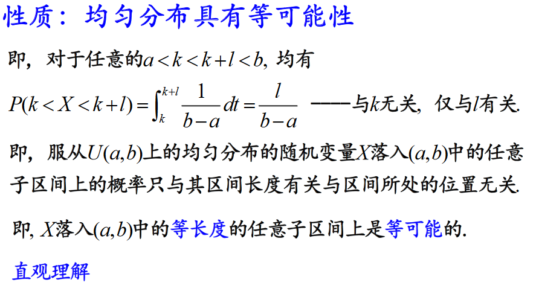
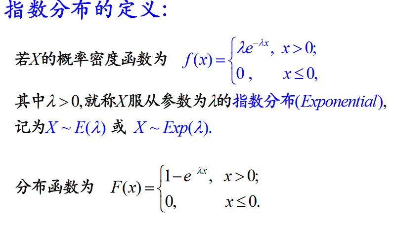
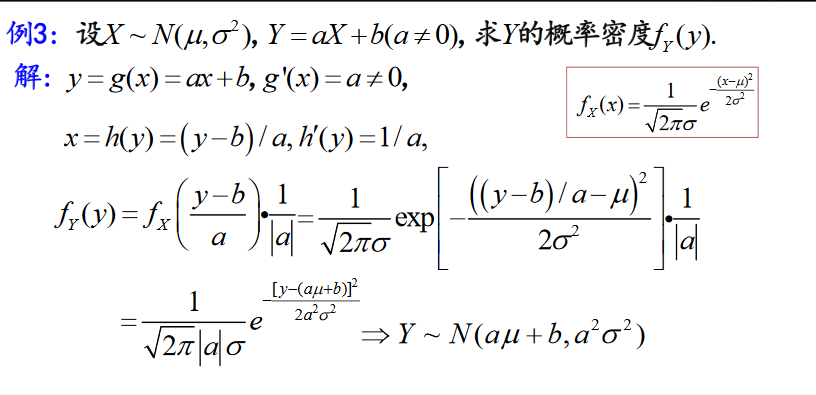
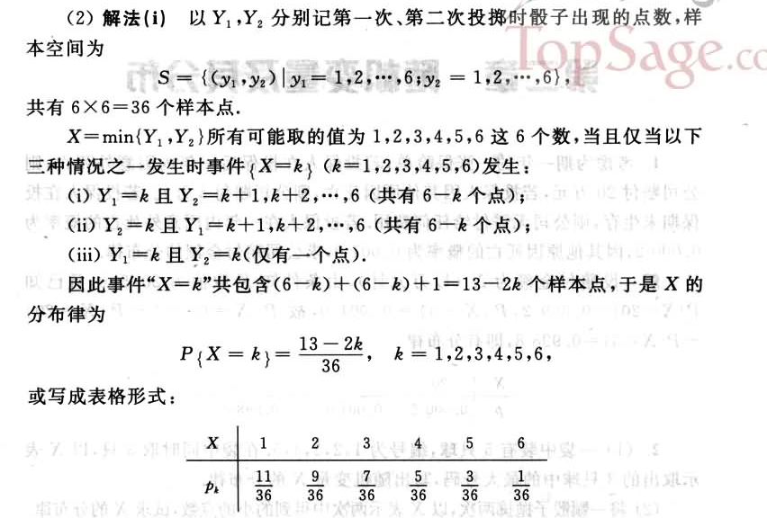
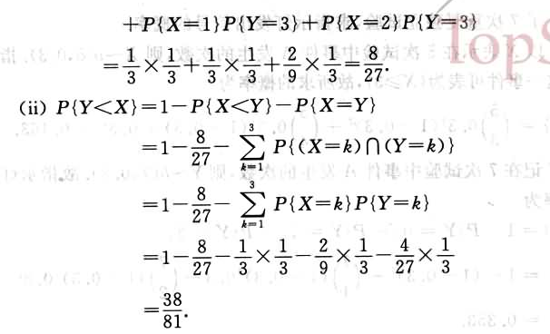

# 随机变量

## 定义


随机变量的本质是一种函数（映射关系），在古典概率模型中，“事件和事件的概率”是核心概念；但是在现代概率论中，“随机变量及其取值规律”是核心概念。

随机变量实际上只是事件的另一种表达方式，这种表达方式更加形式化和符号化，也更加便于理解以及进行逻辑运算。不同的事件，其实就是随机变量不同取值的组合。

>对于随机试验，我们所关心的往往是与所研究的特定问题有关的某个或某些量，而这些量就是随机变量。当然，有时我们所关心的是某个或某些特定的随机事件。例如，在特定一群人中，年收入在万元以上的高收入者，以及年收入在3000元以下的低收入者，各自的比率如何？这看上去像是两个孤立的事件。可是，若我们引入一个随机变量X：
$$X=随机抽出一个人其年收入$$
则X是我们关心的随机变量。上述两个事件可分别表示为${X>10000}$
或${X<3000}$。这就看出：随机事件这个概念实际上包容在随机变量这个更广的概念之内。也可以说，随机事件是从静态的观点来研究随机现象，而随机变量则是一种动态的观点，一如数学分析中的常量与变量的区分那样，变量概念是高等数学有别于初等数学的基础概念。同样，概率论能从计算一些孤立事件的概率发展为一个更高的理论体系，其基本概念就是随机变量。

## 常见的随机变量的分类
1. 离散型随机变量
2. 连续型随机变量

### 离散型随机变量的定义


### 离散型随机变量的分布律


### 例题


## 常见的离散型随机变量
+ 0-1分布(也叫两点分布/伯努利分布)
+ 二项分布(n重伯努利分布)
+ 几何分布
+ 泊松分布
+ 超几何分布

### 0-1分布
##### 定义


##### 例题


##### 现实生活中的例子
+ 检查产品的质量是否合格
+ 对新生婴儿的性别进行登记
+ 检验种子是否发芽
+ 考试是否通过

### 二项分布

#### 定义


### 泊松分布

#### 定义


由$$\sum_{k=0}^{+\infty}P(X=k)=1$$  
$=>$  
$$\sum_{k=0}^{+\infty} \frac{\lambda^k e^{-\lambda}}{k!} = 1$$
$=>$  
$$e^{\lambda} = \sum_{k=0}^{+\infty} \frac{\lambda^k}{k!}$$


#### 泊松分布的应用


+ 某人一天内收到的微信的数量
+ 来到某公共汽车站的乘客
+ 某放射性物质发射出的粒子
+ 显微镜下某区域中的白血球
+ 服务器的流量  

如果某事件以固定强度λ,随机且独立地出现，该事件在单位时间内出现的次数（个数）可以看成是服从泊松分布. 

#### 二项分布与泊松分布的关系
当$n>10, p<0.1$时(n很大，或p很小)，二项分布$B(n,p)$可以用泊松分布$\pi(np)$来近似  
(参见：下边<a href="#泊松分布与二项分布的关系">泊松分布与二项分布的关系，图0-5.1和0-5.2</a>)


二项分布与泊松分布有以下近似公式：  
当$n>10, p<0.1$时，  
$C_n^k p^k(1-p)^{n-k} \approx \frac{e^{-\lambda}\lambda^k}{k!}, 其中\lambda=np$


### 几何分布
(试验进行到第一个出现某种结果为止)


#### 定义


## 分布函数

### 定义


### 性质


### 例题


## 连续性随机变量

### 定义


### 性质


### 例题


### 常见连续性随机变量

+ 均匀分布(Uniform), $X \sim U(a, b)$
+ 指数分布(Exponential)  $X \sim E(\lambda)$
+ 正态分布(Normal)  $X \sim N(\mu, \sigma^2)$

#### 均匀分布
##### 定义


##### 性质





##### 例题


#### 指数分布

##### 定义



##### 性质


##### 应用
+ 指数分布可以用来表示独立随机事件发生的时间间隔，比如旅客进机场的时间间隔、中文维基百科新条目出现的时间间隔等等
+ 在排队论中，一个顾客接受服务的时间长短也可用指数分布来近似
+ 无记忆性的现象(连续时).

##### 例题


#### 正态分布

##### 定义


##### 参数(μ，σ)的意义
$\mu$：均值  
$\sigma$：标准差


##### 正态分布的用途
+ 自然界和人类社会中很多现象可以看做正态分布如:  人的生理尺寸(身高、体重);医学检验指标(红细胞数、血小板);测量误差;等等
+ 多个随机变量的和可以用正态分布来近似(参见：中心极限定理)

##### 正态分布的概率计算


+ 方法一：数值积分法
+ 方法二：转换为标准正态分布$\frac{X-\mu}{\sigma} \sim N(0, 1)$,然后利用标准正态分布表求解
+ 方法三：利用Excel，Matlab，Python等软件进行计算

#### 标准正态分布


#### 性质

$P = C_{10}^5(\dfrac{1}{2}^5)(\dfrac{1}{2}^5)$


#### 例题


## 随机变量函数的分布


### 引语


### 解法

一般，若已知X的概率分布, $Y = g(X)$, 求Y的概率分布的过程为：先给出Y 的可能取值; 再利用**等价事件**来给出概等价事件率分布.

+ 若X为离散型随机变量，则先写出Y的可能取值：$y_1,y_2,\cdots,y_n, \cdots$, 再找出${Y=y_j}$的等价事件${X∈D}$，得$P(Y=y_j) = P(X∈D)$(参考下面例题)


+ 若X为离散型随机变量，则先根据X的取值范围，确定Y的取值范围；然后写出Y的概率分布函数：$F_Y(y) = P(Y≤y)$，找出${Y≤y}的等价事件{X∈D}$，得$F_Y(y) = P(X∈D)$；再求出Y的概率密度函数$f_Y(y)\space(f_Y(y) = {[F_Y(y)]}')$ 


### 相关定理





# 第二章作业题








# 随机变量的基本性质表

|缩写|全拼|中文名|解释|
|:--:|:--:|:----:|:--:|
|CDF |Cumulative Distribution Function|累积分布函数|连续型和离散型都有，一般用$F(X)表示$|
|PDF |Probability Density Function|概率密度分布函数|连续型随机变量在各点的取值规律，用$f(x)$或$f_x(X)$表示|
|PMF |Probability Mass Function|概率质量分布函数|离散性随机变量在各点上的取值的概率|
|RVS |Random Variate Sample|随机变量的样本|随机抽样|
|PPF |Percentile Point Function|百分位数点函数|CDF的反函数，ppf就是p(X<x)=?时的x值|
|IQR |Inter Quartile Range|四分位数间距|25%分位数与75%分位数之差|
| SD |Standard Error|标准差|描述随机变量取值的集中程度|
|SEM |Standard Error of the Mean|样本均值的估计标准误差，简称平均值标准误差||
| CI |Confidence Interval|置信区间||


1. 概率质量函数 vs 概率密度函数  
概率质量函数和概率密度函数不同之处在于：**概率质量函数**是对离散随机变量定义的，本身代表该值的概率；**概率密度函数**是对连续随机变量定义的，本身不是概率，只有对连续随机变量的概率密度函数在某区间内进行积分后才是概率。
2. 累计分布函数 vs 百分位数点函数  
累积分布函数的定义为$F(x)=P(X≤x)=∑P(X∈(−∞,x])$, 因此累积分布函数是给定x求概率；百分位数点函数是累积分布函数的反函数，是已知概率求符合该条件的x.


# python实现

## 一维离散型随机变量


```python
import numpy as np
from scipy import stats
import matplotlib.pyplot as plt
```

利用scipy 调用一个分布函数的常用方法
+ 初始化一个分布函数
+ 调用该分布函数的方法或计算其数值的特征

### 0-1分布

伯努利分布（英语：Bernoulli distribution，又名两点分布或者0-1分布，是一个离散型概率分布，为纪念瑞士科学家雅各布·伯努利而命名。)若伯努利试验成功，则伯努利随机变量取值为1。若伯努利试验失败，则伯努利随机变量取值为0。记其成功概率为$p(0≤p≤1)$，失败概率为$q=1−p$。则其概率质量函数（PMF）为：

$$\begin{equation} \nonumber P_X(x) = \left\{ \begin{array}{1 1} P& \quad \text{for } x=1\\ 1-p& \quad \text{for } x=0\\ 0 & \quad \text{otherwise} \end{array} \right. \end{equation}$$


```python
# bernoilli distribution

# 创建冻结的伯努利分布，并设置概率为p
p = 0.3
ber_dist = stats.bernoulli(p)
# 设置x的取值
x = [0, 1]
x_name = ['0', '1']

# 0-1分布的质量函数(Probability mass function)
pmf = ber_dist.pmf(x)
# 画图（柱状图，柱子的宽度为0.15）
plt.bar(x, pmf, width=0.15)
plt.xticks(x, x_name)
plt.ylabel('Probability')
plt.title('PMF of Bernoulli distribution')
plt.show()
```


$$图0-2 \space \space \space 0-1分布的概率质量分布函数$$

### 二项分布


```python
def binom_distribution(n=1, p=0.1):
    """
    定义一个二项分布的函数
    : n：试验次数 默认为1
    ：p：单次试验发生的概率  默认为0.1
    """
    binom_dis = stats.binom(n, p)
    # 模拟结果 binom_dis.rvs(size=模拟的次数)
    simulation_result = binom_dis.rvs(size=5)  
    print('试验发生的次数分别为：',simulation_result)
    # 计算模拟结果发生的概率
    probabilities = binom_dis.pmf(simulation_result)
    print('试验发生的概率分别为：',probabilities)
    
# 相当于 X-B（20， 0.6）
binom_distribution(20, 0.6)

```

    试验发生的次数分别为： [ 9 11 12 16 14]
    试验发生的概率分别为： [0.07099488 0.15973848 0.17970579 0.03499079 0.1244117 ]
    


```python
def binom_pmf(n=1, p=0.1):
    """
    二项分布有两个参数
    :param n:试验次数
    :param p:单次实验成功的概率
    :return:
    """
    binom_dis = stats.binom(n, p)
    
    # 列出x轴
    # ppf:累积分布函数的反函数，ppf就是p(X<x)=0.0001时的x值。
    x = np.arange(binom_dis.ppf(0.0001), binom_dis.ppf(0.9999))
    
    # 画图
    plt.plot(x, binom_dis.pmf(x), 'bo', label='binom pmf')
    plt.vlines(x, 0, binom_dis.pmf(x), colors='b', lw=5, alpha=0.5)
    plt.legend(loc='best', frameon=False)
    plt.ylabel('Probability')
    plt.title('PMF of binomial distribution(n={}, p={})'.format(n, p))
    plt.show()

binom_pmf(n=20, p=0.6)
```


$$图0-3  \space 二项分布的概率质量分布函数$$

### 泊松分布

泊松分布适合于描述单位时间内随机事件发生的次数的概率分布。如某一服务设施在一定时间内受到的服务请求的次数，电话交换机接到呼叫的次数、汽车站台的候客人数、机器出现的故障数、自然灾害发生的次数、DNA序列的变异数、放射性原子核的衰变数、激光的光子数分布等等。

 


```python
def poisson_pmf(lambda_=3):
    """
    定义一个泊松分布函数，即X~Π(λ)
    lambda_: 泊松分布的参数，默认为3
    """
    # 创建泊松分布
    poisson_dis = stats.poisson(lambda_)
    # 设置x轴
    x = np.arange(poisson_dis.ppf(0.001), poisson_dis.ppf(0.999))
    # 计算对应x轴的点，泊松分布发生的概率
    pmf = poisson_dis.pmf(x)
    
    # 画图
    # ms:点的大小
    plt.plot(x, pmf, 'bo', ms=6,label='poisson pmf')
    # 画图垂直线，lw:(lines width)线的宽度, alpha:透明度
    plt.vlines(x, 0, pmf, colors='b', lw=3, alpha=0.5)
    plt.legend(loc='best', frameon=False)
    plt.show()
    
poisson_pmf(8)
```


$$图0-4   \space 泊松分布的概率分布质量函数$$


### 泊松分布与二项分布的关系


```python
# 创建二项分布函数(还没调用)
def binom_and_poisson_pmf(n, p, lambda_=None):
    """
    定义一个二项分布：X~B（n, p）
    : n:试验次数
    : p:单次试验发生的概率
    : lambda_: 泊松分布的参数, 默认不传, 可以通过lambda_=n*p 求出
    return:返回x轴，二项分布概率质量函数，泊松分布概率质量函数
    """
    # 创建一个泊松分布
    lambda_ = n * p
    poission_dis = stats.poisson(lambda_)
    # 设置x轴
    x = np.arange(poission_dis.ppf(0.001), poission_dis.ppf(0.999))
    # 计算泊松分布对应所有x轴的点，泊松分布的概率质量函数
    # 如：x=1,算出P(x=1)
    poission_pmf = poission_dis.pmf(x)

    # 创建一个二项分布
    binom_dis = stats.binom(n, p)
    # 计算二项分布对应所有x轴的点，二项分布的概率质量函数
    # 如：x=1,算出P(x=1)
    binom_pmf = binom_dis.pmf(x)

    return x, binom_pmf, poission_pmf
```


```python
def drawn(x, binom_pmf, possion_pmf):
    """
    定义画图函数
    : x: x轴
    : binom_pmf, possion_pmf(y轴)：二项分布和泊松分布的概率质量函数值
    """
    plt.plot(x, binom_pmf, 'b-', label='binom (n={}, p={})'.format(n, p))
    plt.plot(x, poission_pmf, 'r--', label='poissiom (λ={})'.format(n * p))
    plt.ylabel('Probability')
    plt.title('Comparing PMF of Poission Dist. and Binomal Dist.')
    plt.legend(loc='best', frameon=False)
    plt.show()
```

如果仅仅是看二项分布与泊松分布的概率质量分布图，也可以发现它们的相似度非常高。事实上这两个分布内在联系十分紧密。泊松分布可以作为二项分布的极限得到。一般来说，若$X∼B(n,p)$，其中$n$很大，$p$很小，而$np=λ$不太大时，则X的分布接近于泊松分布$X \sim \pi(λ)$

从下图中可以非常直观的看到两者的关系：  
图0-5.1，当n很小，p很大时，两者的关系并不是很明显  
图0-5.2，当n很大，p很小时，泊松分布，与二项分布的概率质量函数非常接近
 


```python
# 设置二项分布试验次数n，和单次试验发生的概率p
# 先做8次试验，每次发生的概率为0.5(泊松分布的参数λ=4)
n, p = 8, 0.5

# 接收函数返回值
x, binom_pmf, poission_pmf = binom_and_poisson_pmf(n, p)

# 调用画图函数
drawn(x, binom_pmf, poission_pmf)
```


$$图0-5.1 \space 泊松分布与二项分布质量分布函数的关系$$


```python
# 做50次试验，每次发生的概率为0.08(泊松分布的参数λ=4)
n, p = 50, 0.08
x, binom_pmf, poission_pmf = binom_and_poisson_pmf(n, p)
# 调用画图函数
drawn(x, binom_pmf, poission_pmf)
```


$$图0-5.2 \space 泊松分布与二项分布质量分布函数的关系$$

## 连续性随机变量

### 均匀分布
如果连续型随机变量 X 具有如下的概率密度函数，则称 X 服从 $[a,b]$ 上的均匀分布（uniform distribution）,记作 $X∼U(a,b)$ 或 $X∼Unif(a,b)$

$$\begin{equation}              \nonumber f_X(x) = \left\{               \begin{array}{l l}                 \frac{1}{b-a} & \quad  a < x < b\\                 0 & \quad x < a \textrm{ or } x > b               \end{array} \right.             \end{equation}$$

均匀分布具有等可能性，也就是说，服从 $U(a,b)$ 上的均匀分布的随机变量 X 落入 $(a,b)$  
中的任意子区间上的概率只与其区间长度有关，与区间所处的位置无关。  
由于均匀分布的概率密度函数是一个常数，因此其累积分布函数是一条直线，即随着取值在定义域内的增加，累积分布函数值均匀增加。


$$\begin{equation} 						  \hspace{70pt}                           F_X(x)  = \left\{                           \begin{array}{l l}                             0 & \quad \textrm{for } x < a \\                             \frac{x-a}{b-a} & \quad \textrm{for }a \leq x \leq b\\                             1 & \quad \textrm{for } x > b                           \end{array} \right. 						  \hspace{70pt}                           \end{equation}$$


```python
# 均匀分布需要两个参数区间起点a，终点b。
def uniform_distribution(loc=0, scale=1):
    """
    : loc:区间起点a
    : scale: 区间长度，相当于b-a
    """
    # 创建均匀分布函数X~U（loc, scale+loc）
    uniform_dis = stats.uniform(loc=loc, scale=scale)
    # 将先求出p(X<x_1)=0.001和p(X<x_2)=0.999的x_1、x_2，将区间[x_1, x_2]分成50分
    x = np.linspace(uniform_dis.ppf(0.001), uniform_dis.ppf(0.999), 5)
    pdf = uniform_dis.pdf(x)
    
    # 画图
    fig, ax = plt.subplots(1,1)
    ax.plot(x, pdf, 'k-', lw=2, label='Uniform dist.')
    ax.legend(frameon=False)
    plt.ylabel('Probability')
    plt.title(r'PDF of Uniform (X ~ U({},{}))'.format(loc, scale+loc))
    plt.show()
    
uniform_distribution(loc=2, scale=4)
```


$$图0-6.1 \space 均匀分布的概率密度函数$$


```python

def uniform_cdf(loc=0, scale=1):
    """
    : loc:区间起点a
    : scale: 区间长度，相当于b-a
    """
    # 创建均匀分布函数X~U（loc, scale+loc）
    uniform_dis = stats.uniform(loc=loc, scale=scale)
    # 将先求出p(X<x_1)=0.001和p(X<x_2)=0.999的x_1、x_2，将区间[x_1, x_2]分成50分
    x = np.linspace(uniform_dis.ppf(0.001), uniform_dis.ppf(0.999), 5)
    cdf = uniform_dis.cdf(x)
    
    # 画图
    fig, ax = plt.subplots(1,1)
    ax.plot(x, cdf, 'k-', lw=2, label='Uniform dist.')
    ax.legend(frameon=False)
    plt.ylabel('Probability')
    plt.title(r'CDF of Uniform (X ~ U({},{}))'.format(loc, scale+loc))
    plt.show()
    
uniform_cdf(loc=2, scale=4)
```


$$图0-6.2 \space 均匀分布的累积分布函数$$

### 指数分布

其实指数分布和离散型的泊松分布之间有很大的关系。泊松分布表示单位时间（或单位面积）内随机事件的平均发生次数，指数分布则可以用来表示独立随机事件发生的时间间隔。由于发生次数只能是自然数，所以泊松分布自然就是离散型的随机变量；而时间间隔则可以是任意的实数，因此其定义域是 $(0,+∞)$
。

 

如果一个随机变量 X 的概率密度函数满足一下形式，就称 X 为服从参数 λ 的指数分布(Exponential Distribution)，记做 $X∼E(λ)$ 或 $X∼Exp(λ)$.

指数分布只有一个参数 $λ$，且 $λ>0$.

$$\begin{equation}              \nonumber f_X(x) = \left\{               \begin{array}{l l}                 \lambda e^{-\lambda x} & \quad  x > 0\\                 0 & \quad \textrm{otherwise}               \end{array} \right.             \end{equation}$$


```python
def drawn(scale_1, scale_2, scale_3):
    """
    绘制不同λ的指数分布
    """
    # 构造不同的指数分布x轴和概率密度函数pdf
    exp_dis_1= stats.expon(scale=scale_1)  # λ=1/scale_1
    exp_dis_2= stats.expon(scale=scale_2)  # λ=1/scale_2
    exp_dis_3= stats.expon(scale=scale_3)  # λ=1/scale_3
    
    # 设置不同的x轴
    x_1 = np.linspace(exp_dis_1.ppf(0.001), exp_dis_1.ppf(0.9999), 100)
    x_2 = np.linspace(exp_dis_2.ppf(0.001), exp_dis_2.ppf(0.999), 100)
    x_3 = np.linspace(exp_dis_3.ppf(0.001), exp_dis_3.ppf(0.99), 100)
    
    # 算出概率密度函数
    pdf_1 = exp_dis_1.pdf(x_1)
    pdf_2 = exp_dis_2.pdf(x_2)
    pdf_3 = exp_dis_3.pdf(x_3)
    
    
#     画图
    fig, ax = plt.subplots(1,1)
    ax.plot(x_1, pdf_1, 'r-', lw=2, label='λ={}'.format(1/scale_1))
    ax.plot(x_2, pdf_2, 'g-', lw=2, label='λ={}'.format(1/scale_2))    
    ax.plot(x_3, pdf_3, 'b-', lw=2, label='λ={}'.format(1/scale_3))    
    plt.ylabel('Probability')
    plt.legend(loc='best', frameon=False)
    plt.title('Difference of PDF of Exponential Dist.')
    plt.show()
 
            
drawn(scale_1=0.5,scale_2=1,scale_3=2)

```


$$图0-7.1 \space 不同λ的指数分布概率密度函数$$


```python
def drawn(scale_1, scale_2, scale_3):
    """
    绘制不同λ的指数分布累积分布函数
    """
    # 构造不同的指数分布x轴和概率密度函数pdf
    exp_dis_1= stats.expon(scale=scale_1)  # λ=1/scale_1
    exp_dis_2= stats.expon(scale=scale_2)  # λ=1/scale_2
    exp_dis_3= stats.expon(scale=scale_3)  # λ=1/scale_3
    
    # 设置不同的x轴
    x_1 = np.linspace(exp_dis_1.ppf(0.001), exp_dis_1.ppf(0.9999), 100)
    x_2 = np.linspace(exp_dis_2.ppf(0.001), exp_dis_2.ppf(0.999), 100)
    x_3 = np.linspace(exp_dis_3.ppf(0.001), exp_dis_3.ppf(0.99), 100)
    
    # 算出概率密度函数
    cdf_1 = exp_dis_1.cdf(x_1)
    cdf_2 = exp_dis_2.cdf(x_2)
    cdf_3 = exp_dis_3.cdf(x_3)
    
    
#     画图
    fig, ax = plt.subplots(1,1)
    ax.plot(x_1, cdf_1, 'r-', lw=2, label='λ={}'.format(1/scale_1))
    ax.plot(x_2, cdf_2, 'g-', lw=2, label='λ={}'.format(1/scale_2))    
    ax.plot(x_3, cdf_3, 'b-', lw=2, label='λ={}'.format(1/scale_3))    
    plt.ylabel('Probability')
    plt.legend(loc='best', frameon=False)
    plt.title('Difference of CDF of Exponential Dist.')
    plt.show()
 
            
drawn(scale_1=0.5,scale_2=1,scale_3=2)
```


$$图0-7.2 \space 不同λ的指数分布累积分布函数$$

### 正态分布


```python
# 创建一个冻结的均值为5，标准差为3正态分布(frozen distribution)
mu = 5
sigma = 3
norm_dis = stats.norm(mu, sigma)

# 在3个标准差(sigma)上均匀取101个点
x = np.linspace(mu-3*sigma, mu+3*sigma, 101)

# 计算该分布在x中的点的概率密度分布函数值PDF(即，概率P)
pdf = norm_dis.pdf(x)

# 计算该分布在x中的每个点的累积分布函数值(即，概率论里边的分布函数F（X）)
cdf = norm_dis.cdf(x)

# 准备画两个图(两行一列)
# 上边的图为正态分布坐标和概率
# 下边的图为正态分布坐标和分布函数
plt.figure(1)

# 先画第一个图，两行一列，第一个图(子图)
plt.subplot(211)
# plt.plot(x, y, '怎么画图'，'设置标签')
plt.plot(x, pdf, 'b-', label='pdf')
# 设置y轴的标签为Probability(概率)
plt.ylabel('Probability')
# 设置x轴的标签为x
plt.xlabel('x')
# 设置图像标题
plt.title(r'PDF/CDF of normal distribution')
# 在坐标(-4, 0.1) 打印一段文字
plt.text(-4, .1, r'$\mu=5,  \sigma=3$')
# 在右上角显示图像的标签,标签不显示边框
plt.legend(loc='best', frameon=False)


# 开始画第二个图
plt.subplot(212)
plt.plot(x, cdf, 'r-', label='cdf')
plt.ylabel('Probability')
plt.legend(loc='best', frameon=False)

# 将图片展示
plt.show()
```


$$图0-8.1: 正态分布X\sim N(5,3^2) 的概率密度函数和分布函数$$

标准正态分布


```python
def standard_norm_dis(sigma, mu=0):
    """
    创建标准正态分布
    : mu: 均值μ
    : sigma: 标准差sigma
    """
    # 创建标准正态分布函数
    norm_dis = stats.norm(mu, sigma)
    # 设置x轴, 在区间[μ-3σ, μ+3σ]
    x = np.linspace(mu-3*sigma, mu+3*sigma, 101)
    # 算出概率密度
    pdf = norm_dis.pdf(x)
    # 算出累积分布
    cdf = norm_dis.cdf(x)
    return x, pdf, cdf
```


```python
def drawn(**kwargs):
    """
    绘制不同σ的标准正态分布，概率密度函数和累积分布函数
    : pdf :概率密度
    : cdf :累积分布
    """
    sigma_1 = kwargs['sigma_1']
    sigma_2 = kwargs['sigma_2']
    sigma_3 = kwargs['sigma_3']
    # 创建不同σ的标准正态分布
    x_1, pdf_1, cdf_1 = standard_norm_dis(sigma=sigma_1) 
    x_2, pdf_2, cdf_2 = standard_norm_dis(sigma=sigma_2) 
    x_3, pdf_3, cdf_3 = standard_norm_dis(sigma=sigma_3) 
    
    # 画图
    # 子图1，用于绘制pdf
    plt.subplot(211)
    plt.ylabel('Probability')
    plt.title('PDF/CDF of standard normal distribution')
    plt.plot(x_1, pdf_1, 'r-', label='$\mu={}, \sigma={}$'.format(0, sigma_1))
    plt.plot(x_2, pdf_2, 'g-', label='$\mu={}, \sigma={}$'.format(0, sigma_2))    
    plt.plot(x_3, pdf_3, 'b-', label='$\mu={}, \sigma={}$'.format(0, sigma_3))
    plt.legend(loc='best', frameon=False)
    
    # 子图2，用于绘制cdf
    plt.subplot(212)
    plt.ylabel('Probability')
    plt.plot(x_1, cdf_1, 'r-', label='$\mu={}, \sigma={}$'.format(0, sigma_1))
    plt.plot(x_2, cdf_2, 'g-', label='$\mu={}, \sigma={}$'.format(0, sigma_2))    
    plt.plot(x_3, cdf_3, 'b-', label='$\mu={}, \sigma={}$'.format(0, sigma_3))
    plt.legend(loc='best', frameon=False)
    
    plt.show()
    
```


```python
drawn(sigma_1=1,sigma_2=2,sigma_3=3)
```


