# 依概率收敛，切比雪夫不等式

## 依概率收敛
(频率的稳定值记作概率)
### 对于稳定值的理解：
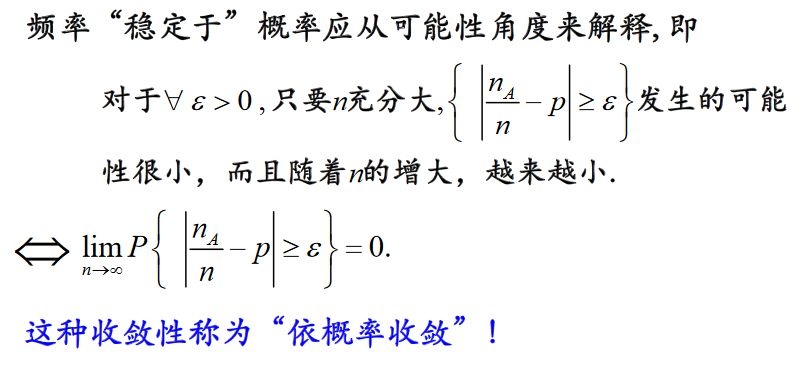

### 定义：
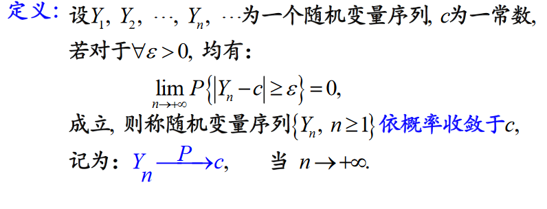


### 性质：
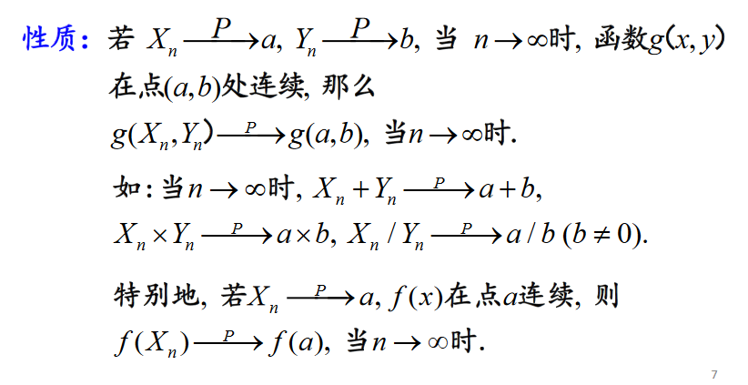

## 切比雪夫不等式
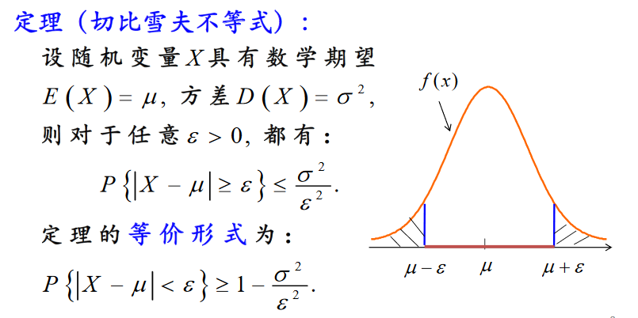


### 证明
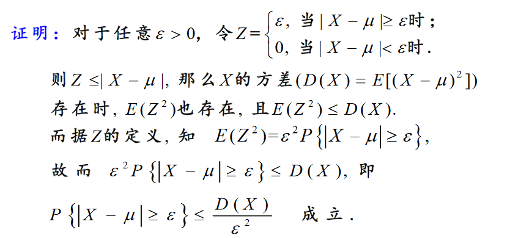


### 适用范围及重要性
(适用范围广，但其结果会比较粗糙)
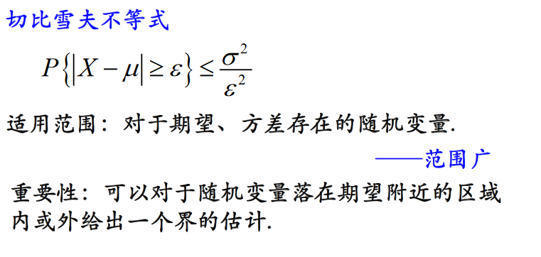


# 大数定律

## 小数定律
(丹尼尔·卡尼曼提出，对'赌徒谬误'的总结，用于描绘人们的非理性行为)
>如果**统计数据很少**，事件会表现为各自**极端情况**，而这些情况都是**偶然事件**，跟它的**期望值一点关系都没有**。

案例：当投资者观察到一位投资经理在过去两年表现好于其他人，就总结说这位经理水平要高一些，而这一结论的统计含义太弱。另一个相关的例子称为“赌博者谬误”：许多人都经常预期一个随机赌局的第二轮会得到与第一轮相反的结果，而实际上，每一轮在统计上都是独立的。如果一项投硬币游戏前若干轮出现太多的“头像”，那么许多参与者确信下一轮便应该是“文字”了。

## 大数定律
(简单地理解为：大量的重复实验的结果的平均值接近于它的数学期望)


### 弱大数定律(辛钦大数定律)
#### 定义：
$X_1,X_2,...,X_n,...$为**独立同分布**的随机变量，且它的数学期望存在，记作$E(X_k)=\mu (k=1,2,...)$，作前n个变量的算数平均值$\bar{X} = \frac{1}{n} \displaystyle \sum_{k=1}^{n}X_k$，对于$\forall \varepsilon>0$，有  
$$\displaystyle \lim_{ n \to \infty } P(| \bar{X}_n - \mu| \geq \varepsilon) = 0 \hspace{ 10pt } $$  或
$$\frac{1}{n} \displaystyle \sum_ {k=1}^{n}X_k\overset{p}{\rightarrow}\mu, \space当 \space n \rightarrow \infty$$
(定义的简单理解：当样本n足够大时，可以通过样本的算术平均值估计数学期望)


#### 证明
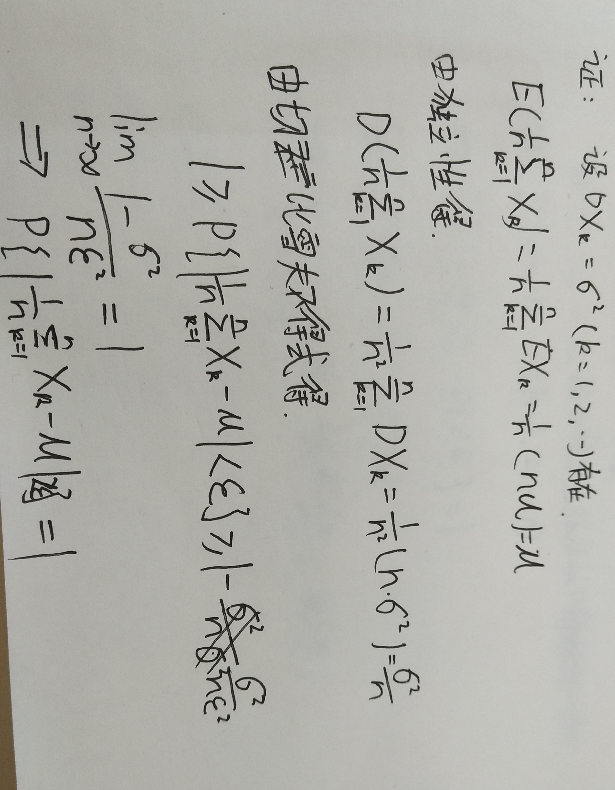


#### 辛钦大数定律的意义
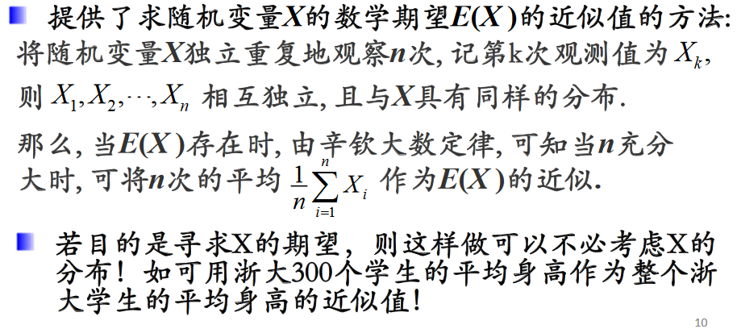

### 伯努利大数定律
#### 定义
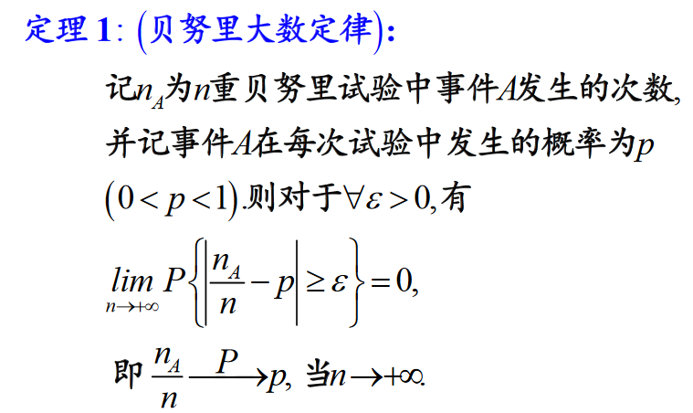
(定义的简单理解：当样本足够大时，可以用样本的频率来估计总体的概率)

#### 证明
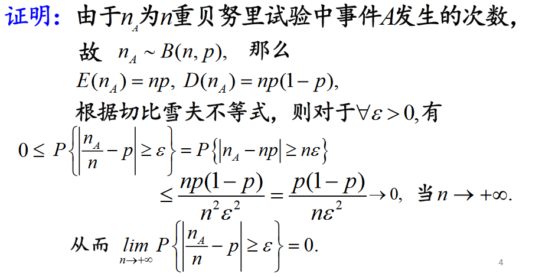
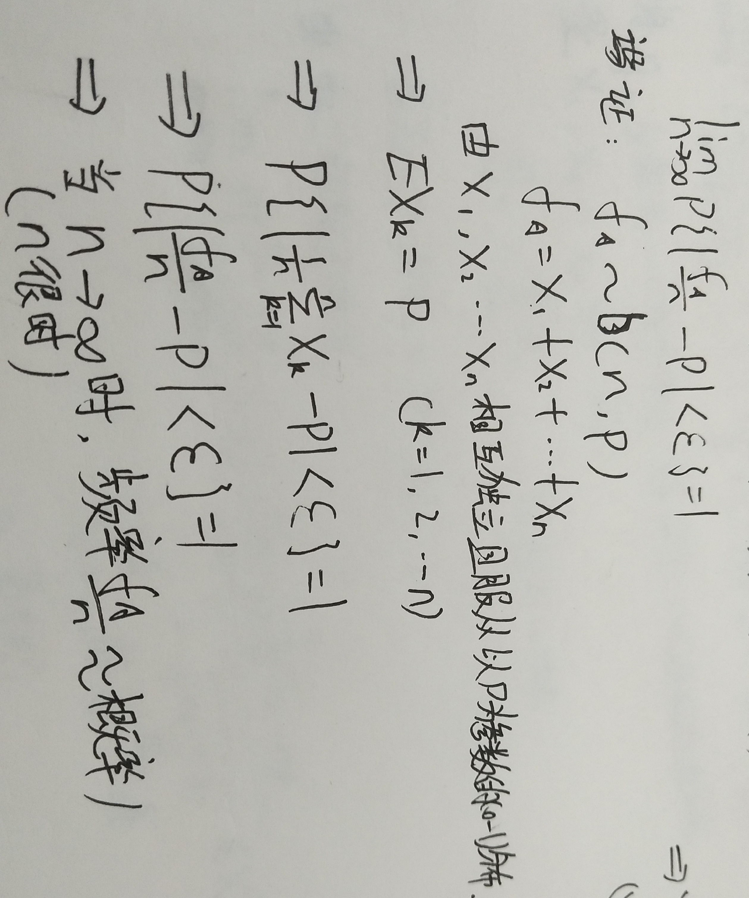


#### 意义
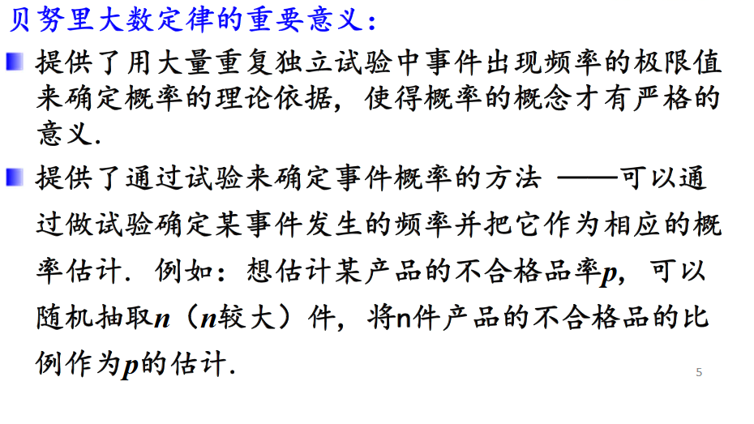

### 强大数定律(了解)
([来源：知乎](https://www.zhihu.com/question/21110761))
#### 定义
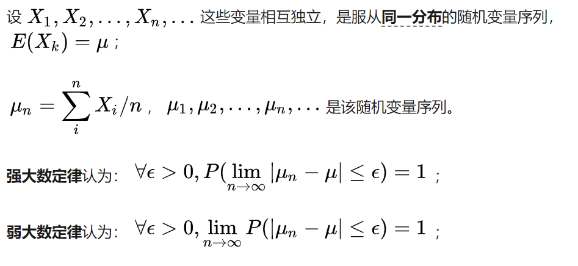

#### 强大数定律与弱大数定律
大数定律想要证明**当对一个随机变量进行无限次采样时，得到的平均值会无限接近真实的期望值**。 强大数定律想证明：采样的次数越多，平均值**几乎一定**越来接近真实期望值； 弱大数定律想证明：采样的次数越多，平均值接近真实期望值的**可能性越来越大**。

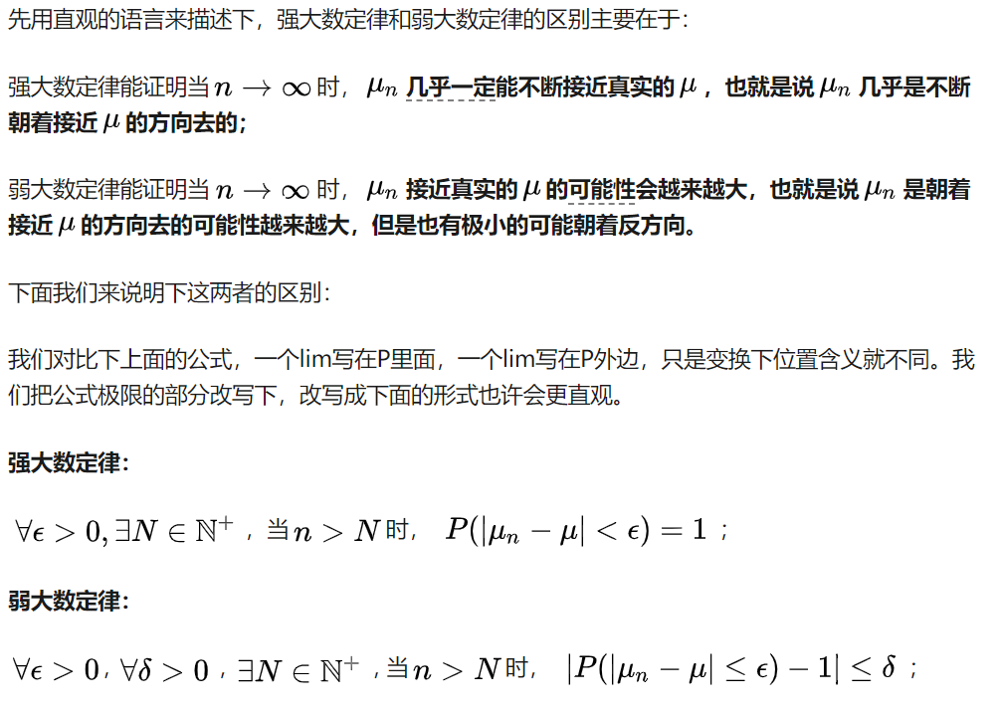

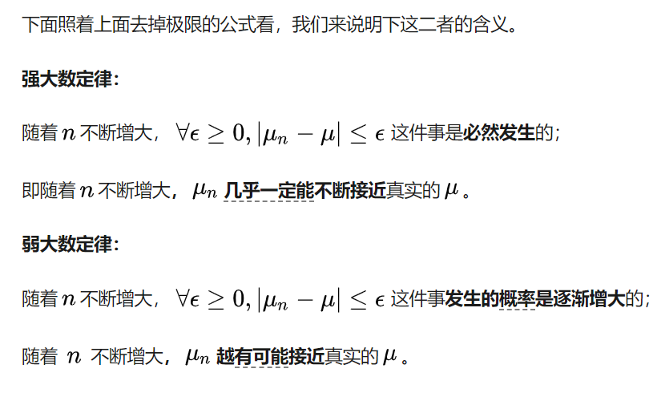

# 中心极限定理
(中心极限定理的简单理解：1.样本的平均值约等于总体的平均值 2.不管样本是什么分布，样本的平均值会围绕在总体平均值周围，并呈现正态分布)

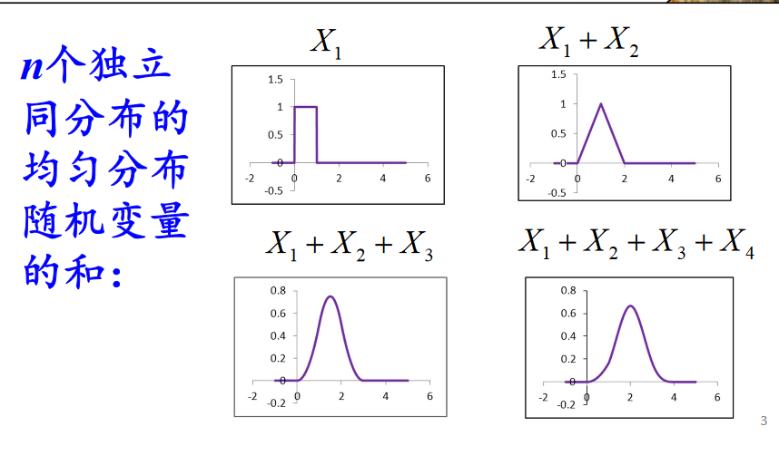

## 独立同分布的中心极限定理
### 定义
一般来说，n个独立同分布的随机变量的和的分布函数是比较难求的，而通过中心极限定理，可以描述当n足够大的时候，这些随机变量的和的分布**近似服从正态分布**。下面主要讲述两条中心极限定理的
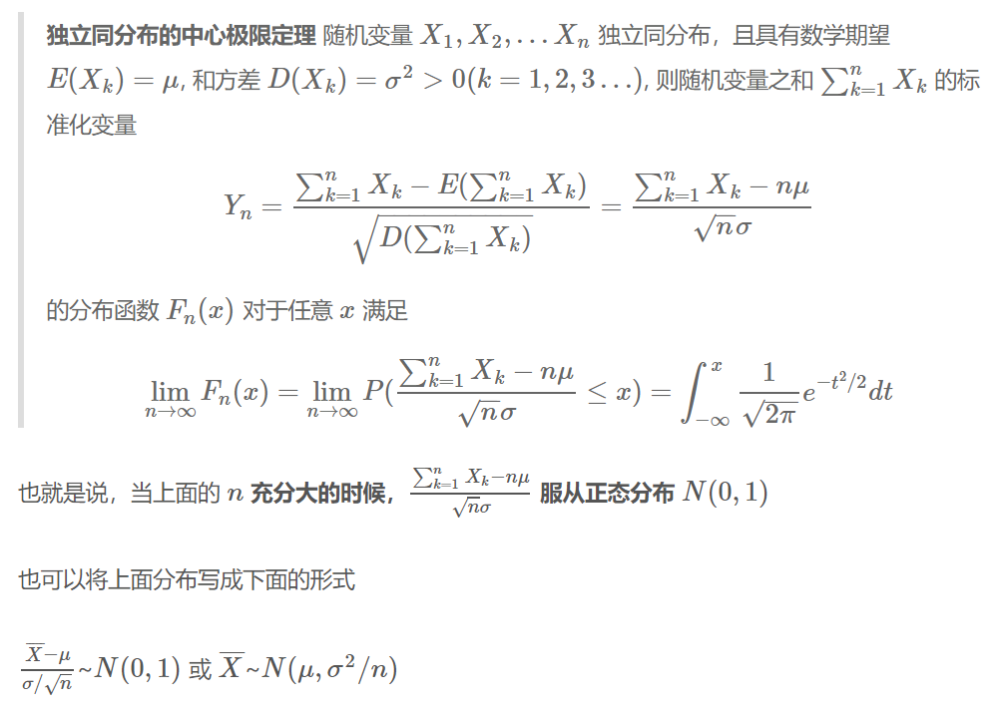

也就是说，当样本的数量n足够大的时候，样本均值服从均值为 $μ$, 方差为 $σ^2/n$ 的正态分布， 其中 $μ$ 和 $σ$ 分别是原来随机变量的所服从的分布的期望和方差，这一结果是数理统计中大样本统计推断的基础。

### 适用范围
1. 每个随机变量都是同分布的，也就是具有同样的期望和方差
2. 每组样本要足够大(一般认为每组大于30个，就可以让中心极限定理发挥作用)

## 德莫夫-拉普拉斯中心极限定理

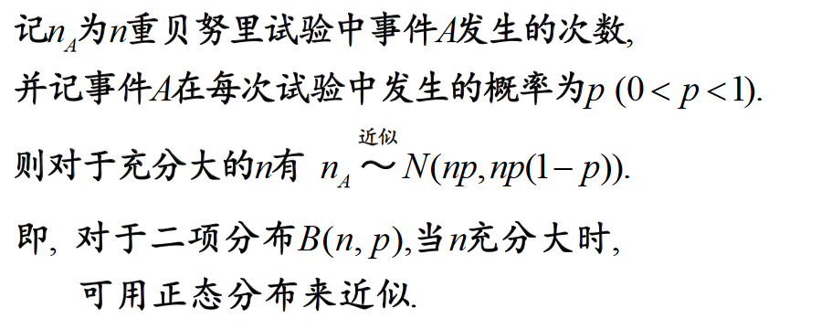

$$\frac {\bar{X} - {np}}{\sqrt{np(1-p)}} \sim N(0,1)$$

# 大数定律python实现


```python
import numpy as np
import matplotlib.pyplot as plt
from scipy import stats
```


```python
# 实验1
def get_sample(x_i):
    """获取0-1分布样本，即X_i"""
    sample = np.random.rand(x_i)
    return sample


times = 100000  # 模拟10000次
mean_arr = np.empty(times)  # 用于接收样本的平均值
for i in range(1, times+1):
    sample = get_sample(i)
    mean_arr[i-1] = sample.mean()  # 获取样本的平均值
# print(mean_arr)

# 绘图
plt.xlabel = 'X_i'
plt.ylabel = 'mean'
plt.plot(mean_arr)
plt.hlines(0.5, 0, times, color='red')  # 0.5 为0-1分布的数学期望，0，times 坐标轴x从0-times
plt.show()
```


```python
# 实验2
def get_sample(i=20):
    """
    获取0-1分布样本，即X_i
    i：每个样本有i个数据，默认有20个数据
    """
    sample = np.random.rand(i)
    return sample


def x_n_arithmetic_mean(i):
    """
    i: 模拟的次数
    相当于：产生X_1,X_2,...,X_i的随机变量数列
    return: 
    """
    mean_arr = np.empty(i)  # 用于接收样本的平均值
    for i in range(1, i+1):
        sample = get_sample()  
        mean_arr[i-1] = sample.mean()  # 获取样本的平均值
    return mean_arr.mean()
    
def main():
    """
    times:模拟的次数
    """
    times = 10000
    mean_arr = np.empty(times)
    for i in range(1,times+1):
        arithmetic_mean = x_n_arithmetic_mean(i)  # 获取X_1,X_2,...,X_I的算术平均值
        mean_arr[i-1] = arithmetic_mean
    return mean_arr

if __name__ == '__main__':
    mean_arr = main()
#     print(mean_arr)
    plt.xlabel = 'sum_{i=1}{i}X_i'
    plt.ylabel = 'mean'
    plt.plot(mean_arr)
    plt.hlines(0.5, 0, times, color='black')  # 0.5 为0-1分布的数学期望，0，times 坐标轴x从0-times
    plt.show()
    
```


```python
# 实验3
def frequency(times):
    """
    随机生成一个0或1的n维数组（n = size）
    相当于投掷了n次硬币，记头朝上为1，朝下为0
    times：模拟的次数
    return:头朝上的发送的次数(朝上的次数/总次数)
    """
    x = np.random.randint(0,2,size=times)  
    return x.sum()/times

def main(times):
    ret = np.empty(times)
    for t in range(1, times+1):
        ret[t-1] = frequency(t)
    return ret

if __name__ == '__main__':
    times = 100000
    ret = main(times)
#     print(ret)
    plt.xlabel = 'times'
    plt.ylabel = 'frequency'
    plt.plot(ret)
    plt.hlines(0.5, 0, times, linestyles='dashed', color='red')
    plt.show()
```


**结论：**由上述实验可以看出，当模拟的次数越多时(即n->infinity)时，样本的算术平均值可以近似代替数学期望。  
$\displaystyle \lim_{n \to \infty}时 \frac{1}{n}\displaystyle \sum_{k=1}^{n} =  \mu$


# 中心极限定理python实现

## 中心极限定理之样本大小取值的影响


```python
import numpy as np
import matplotlib.pyplot as plt
from scipy import stats
```


```python
def sampling2pmf(n, dist, times=10000):
    """
    计算样本的概率质量函数
    : n: 每个样本取样的个数
    : dist: 分布函数(二项分布、指数分布等等)
    : times: 试验的次数
    : rerun : 返回times次试验的概率质量函数
    """
    sum_of_samples = []
    for i in range(times):
        # 取样
        samples = dist.rvs(size=n)
        # 对样本求和
        sum_of_samples.append(np.sum(samples))
    # 统计样本求和后，出现次数的频率
    val, counts = np.unique(sum_of_samples, return_counts=True)
    # 计算频率
    pmf = counts / times
    return val, pmf


def plot(n, dist, subplot, plt_handle, bins=10000):
    """
    : n: 样本取样的大小
    : dist: 分布函数
    : subplot: 子图的位置
    : plt_handle: 图片处理器
    : bins: 每个柱状之间的间隔
    : return: plt object
    """
    plt = plt_handle
    plt.subplot(subplot)
    # 计算标准正态分布的均值μ
    # 根据拉普拉斯中心极限定理，n_A ~近似~N（np, [np(1-p)]^(0.5)）
    mu = n * dist.mean()
    sigma = np.sqrt(n * dist.var())
    samples = sampling2pmf(n=n, dist=dist)
    plt.vlines(samples[0], 0, samples[1], colors='g', linestyles='-', lw=3)
    plt.ylabel('Probability')
    plt.title('Sum of bernoulli dist. (n={})'.format(n))
    # 绘制正态分布
    norm_dis = stats.norm(mu, sigma)
    x = np.linspace(mu-3*sigma, mu+3*sigma, bins)
    pdf = norm_dis.pdf(x)
    plt.plot(x, pdf, 'r--')
    return plt

```


```python
size = [1, 4, 20, 80, 200, 1000]

dist_type = 'bernoulli'
# 伯努利分布的概率
bernoulli_p = 0.4
single_sample_dist = stats.bernoulli(p=bernoulli_p)

# 画图
plt.figure(1)
for i in range(len(size)):
    plt = plot(n=size[i], dist=single_sample_dist, subplot=321+i, plt_handle=plt)
    subplot_num +=1
plt.tight_layout()
plt.savefig('sum_of_{}_dist.png'.format(dist_type), dpi=200)

```


```python
size = [1, 4, 20, 80, 200, 1000]

dist_type = 'binomal'
single_sample_dist = stats.binom(20, 0.4)

# 画图
plt.figure(1)
for i in range(len(size)):
    plt = plot(n=size[i], dist=single_sample_dist, subplot=321+i, plt_handle=plt)
    subplot_num +=1
plt.tight_layout()
plt.savefig('sum_of_{}_dist.png'.format(dist_type), dpi=200)

```
