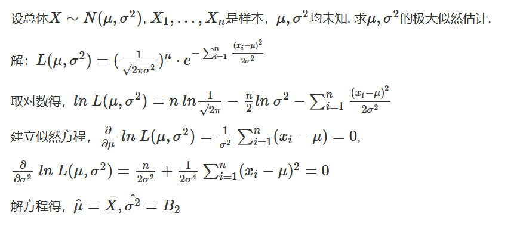
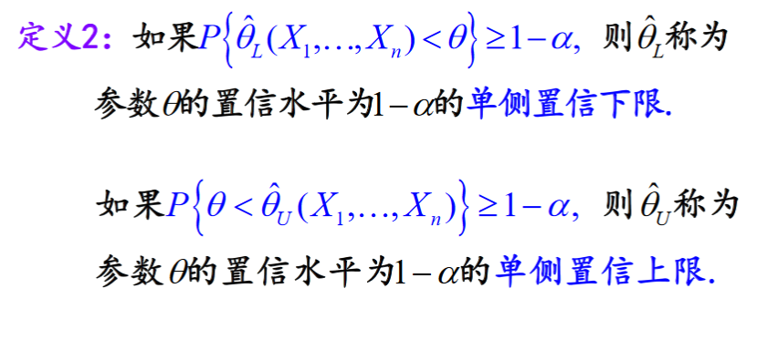
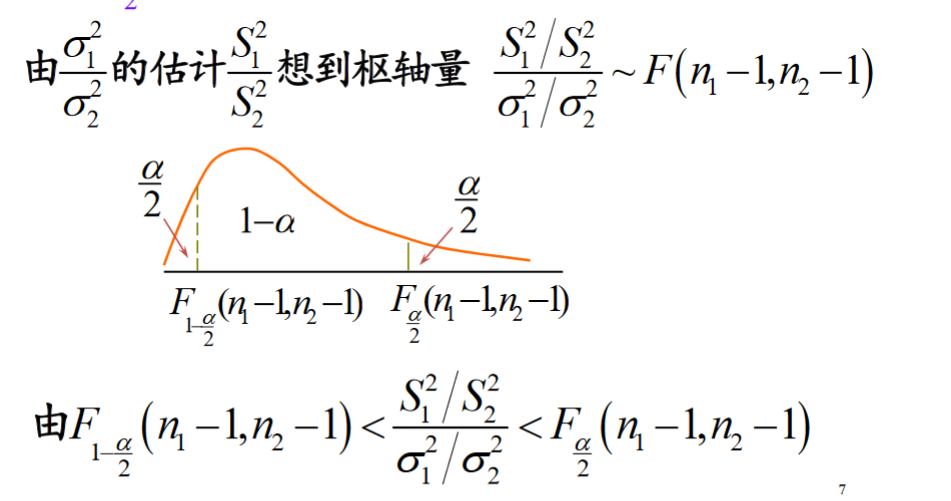

# 参数及参数估计

**参数**是总体分布中的参数，反映的是总体某方面特征的量。例如：合格率，均值，方差，中位数等。  

**参数估计**就是我们抽总体抽出一组样本，用某种方法对未知参数进行估计

参数估计可以分为两类
+ 点估计
    + 矩估计
    + 极大似然估计
+ 区间估计

## 点估计

### 矩估计
#### 矩的概念


#### 矩的符号表示
+ $\mu_k$：总体的k阶原点矩
+ $A_k$：样本的k阶原点矩
+ $\nu_k$：总体的k阶中心距
+ $B_k$：样本的k阶中心距

#### 引例


#### 统计思想
矩估计是英国统计学家卡尔·皮尔逊(相关系数也是他搞的)于1894年提出的。是基于一种简单的 **“替换”** 思想建立起来的一种估计方法。其**基本思想**是以样本矩估计总体矩，以样本矩的函数估计总体矩的函数。

#### 理论依据


#### 建立矩估计的步骤

简单地说，只要可以将一个带估计的参数用总体矩(单个矩或不同矩的函数)表示出来，就可以用对应的样本矩替换总体矩


#### 示例


求总体的标准差$\sigma$的矩估计值

解：  
1. 建立未知参数与总体的联系，  
总体的一阶(原点)矩$\mu_1$ = $E(X)$ = $\mu$  
总体的二阶(原点)矩$\mu_2$ = $E(X^2) = D(X) + E^2(X) =\mu^2 + \sigma^2$  
$\Rightarrow$  
2. 求出各参数关于k阶矩的反函数  
$\mu = \mu_1$  
$\sigma = \sqrt{\mu_2 - \mu^2}$  
3. 用样本的各阶矩替换总体的各阶矩，得出参数(估计出来的参数上面都带有符号加以区分。如估计总体方差$\sigma$, 估计值为$\hat{\sigma}$)  
样本的一阶(原点)矩:  
$\hat{\mu} =  A_1 = E(x_i) = \bar{x} = 72.3$   
样本的二阶(原点)矩:    
$\hat{\sigma} = \sqrt{A_2 - A_1^2} = \sqrt{\displaystyle \sum_{i=1}^{n}x_i - \bar{X}^2} = \sqrt{B_2} = \sqrt{\frac{n-1}{n}S^2} = \sqrt{\frac{99}{100}×15.8^2} = 15.7$ 


解：  
1. 建立未知参数与总体的联系  
总体的一阶矩: $\mu_1 = E(X) = p$  
2. 求出反函数  
$p = \mu_1$
3. 用样本矩代替总体矩  
$\hat p = A_1 = \bar X$  
**推论**：用样本比例估计总体比例


#### 推论
1. 总体的均值可以用样本均值来估计
2. 总体的标准差可以用样本的方差通过一系列计算来估计($\hat\sigma = \sqrt{\frac{n-1}{n}S^2}$ )

#### 矩估计法的评价
1. 原理直观
2. 只用到总体矩，用法简单，但如果总体矩估计不存在，则无法求出参数的点估计
3. 没有用到总体的分布形式，所以总体分布包括的参数信息没有加以利用
4. 矩估计是基于大数定律，所以在大样本下的矩估计效果比较好

### 极大似然估计

#### 引例
1. 
如果一个老兵和一个新兵打靶，但仅有一个人命中，问谁命中的可能性大？  
(1) 老兵 (2) 新兵  
答: 老兵，因为它更符号情理


2. 有两个外形相同的箱子， A和B，各装100个球  
A箱：99个白球， 1个红球  
B箱：1个白球，99个红球  
现从两箱中任取一球，结果所取得的球是白球  
问：所取的球来自哪一个箱？  
答：A箱，因为它的可能性更大


思想方法：一个随机试验有若干的可能性，某结果发生了，**则认为该结果(事件)发生的概率最大**


#### 定义

设离散型总体$X \sim p(x;\theta)$, $\theta$为未知参数。$X_1,\cdots,X_n$为来自X的样本，n为随机变量($X_1, \cdots，X_n$)的联合概率密度函数记为：  
$$L(x_1,\cdots,x_n;\theta) = \prod_{i=1}^{n}f(x_i;\theta)$$  
称之为参数$\theta$的**似然函数**  
(对于离散型样本，其似然函数为其联合分布律)

>极大似然估计法：  
求参数$\theta$的估计值，使得似然函数达到极大值

#### 极大似然估计量/估计值的定义

若$L(x_1,\dots, x_n;\hat{\theta}) = max_{\theta}L(x_1,\dots,x_n;\theta)$，则称$\hat{\theta}$为$\theta$的极大似然估计值   
相应的估计量 $\hat{\theta} = \hat{\theta}(X_1,\dots, X_n)$  
称为参数$\theta$的**极大似然估计量**

>Note：  
$lnL$是L的严格单调递增函数，$lnL$与L有相同的极大值点，**一般**只需要求$lnL$的极大值点

#### 极大似然估计的**一般步骤**

1. 写出似然函数：$L(x_1,\cdots,x_n;\theta) = \prod_{i=1}^{n}f(x_i;\theta)$  
连续型为联合概率密度，离散型为联合分布律  
2. 对似然函数取对数：  
$lnL = \displaystyle \sum_{i=1}^{n}f(x_i;\theta_1,\dots,\theta_m)$
3. 对$\theta_j(j=1,\dots,m)$分别求偏导数，建立似然方程(组):   
$$\frac{\partial lnL}{\partial \theta_j} = 0  (j = 1,2,...,m)$$  
解得$\hat{\theta}_1,...,\hat{\theta}_m$的<u>极大估计值</u>




#### 补充
1. 极大似然估计值是一个数值，极大似然估计量是一个随机变量（同时也是一个统计量）；
2. 似然函数是能够反映试验结果发生的概率大小的函数；
3. 从极大似然估计的定义可以看出来，使用该方法时总体的概率密度函数形式是明确的（包含未知参数）；
4. 未知参数可能不止一个，设为$θ=(θ_1,θ_2,...,θ_k)$；  
5. 若$L(θ)$关于某个$θ_i$是单调递增(减)函数，则$θ_i$的极大似然估计为$θ_i$的最大(小)值(与样本无关)

### 小结
1. 矩估计量和极大似然估计量不一定完全相同
2. 用矩估计参数比较方便
3. 但样本容量比较大时，极大似然估计法的精度高

## 估计量的评价准则--无偏性

对于一个参数，矩估计法和极大似然估计法得到的结果可能不一样，那么如何选择合适的方法，采取什么样的标准？


### 无偏性(没有系统误差)


例如，工厂长期为商家提供某种商品，假设生产过程相对稳定，产品合格率为θ，虽然一批货的合格率可能会高于θ，或低于θ，但无偏性能够保证在较长一段时间内合格率接近θ，所以双方互不吃亏。**但作为顾客购买商品，只有二种可能，即买到的是合格品或不合格品，此时无偏性没有意义。**

例子


无偏性是解决系统误差为0，但系统误差有正、负，当正负抵消的时候就无法判断参数估计是否有效。

### 有效性

根据方差可以确定两个无偏估计是否有效。  


### 均方差准则(不需要是无偏估计量)


## 区间估计

### 点估计与区间估计的比较

根据具体样本观察值，点估计提供了一个明确的数值。但是这种**判断的把握**有多大，点估计本身并没有给出。区间估计就是为了弥补点估计的这种不足而提出来的。

相同点：   
+ 都可以给出未知参数的估计
+ 估计的准确度与采集的样本有关


不同点：
+ 点估计需要的信息少， 得到的估计值也比较粗糙
+ 区间估计需要的信息更多(除了样本，还需要知道总体的某些数字特征或分布形式)，得到的结果是一个包含置信水平的区间

区间估计的目的：  
设X是总体，$X_1,...,X_n$

是一个样本. 区间估计的目的是找到两个统计量：

$\hat{θ}_1=\hat{θ}_1(X_1,...,X_n)$,

$\hat{θ}_2=\hat{θ}_2(X1,...,Xn)$,

使随机区间($\hat{θ}_1,\hat{θ}_2$)
以一定可靠程度盖住θ.

### 定义


若$μ=0.5$,当$\bar{x}$分别为3，2，1时，对应区间为：  
$$(1,5)没有包含μ, (0,4)包含μ，(-1,3)包含μ$$

对于一个具体的区间而言，或者包含真值或者不包含真值，无概率可言

$(\bar{X}-2, \bar{X}+2)$是$μ$的置信水平为0.95的*置信区间*中的*置信水平为0.95*的意义是什么？


### 单侧置信区间

如果我们只关心单侧置信区间。如，我们只关心某种产品的最小寿命，或者我们值关心某种药物的最大毒性时，就需要用到单侧置信区间




### 精确度 


>Neyman原则： 在置信水平达到1-α的置信区间中，选择精确度尽可能高的置信区间


在给定的样本容量下，置信水平与精确度是相互制约的。即，置信水平越高，精确度就越低。如果置信水平非常高(比如，置信水平为1)，那么置信区间会非常宽。这个时候，无论桌面抽样，得到的区间几乎包含真值。但由于范围太大，这种估计也就失去意义。  
比如，我们要估计一个电影院一天来看电影的人数。如果我们给出置信区间(0,1000000),这样的置信水平会非常高，但这种估计就没有价值

## 枢轴量法

问题导论：  
设总体X的分布有未知参数$θ，X_1,...,X_n$是一个样本，如何给出$θ$的  
1. 置信水平为$1-α$的双侧置信区间？  
2. 置信水平为$1-α$的单侧置信下限？
3. 置信水平为$1-α$的单侧置信上限？

方法：  
1. 找一个随机变量G， 使得G的**分布已知**
2. 找$a<b$，使得$P(a<G<b) ≥1-α$  
因为要求$θ$的区间估计，所有G应该是**$θ$和样本$X_1,...,X_n$的函数**  
3. 从$a<G<b$解出$\hat{θ}_L < \theta <\hat{\theta}_U$  
$(\hat{\theta}_L, \hat{\theta}_U)$就是置信度为$1-α$的双侧置信区间


如，我们要估计全校学生的身高(总体)的平均值的取值范围(区间估计)，我们可以先抽取一部分样本，用样本的平均值估计全校学生的身高(总体)，由前面学到的知识我们可以构造这样的随机变量：  
$$\bar{X} \sim N(\mu, \sigma^2/n)$$  
相当于我们已经找到一个随机变量G，  
然后可以通过正态分布求出全校学生身高在某一区间的概率(置信度)

### 枢轴量的定义


### 枢轴量和统计量的区别
枢轴量和统计量都是随机变量，那它们的区别是：  
1. 枢轴量是样本和待估计参数的函数，其分布**不依赖于任何未知参数**。(即，枢轴量不能只能含有样本值和待估计的参数，不能含有其他未知参数)
2. 统计量**只是样本的函数**，其分布常依赖于未知参数。


1. 只有$\bar{X}$是统计量，其他两个都含有未知参数，不是统计量

2. 因为要估计参数$\mu$， 而$\frac{\bar{X}-\mu}{\sigma/\sqrt{n}}$中含有其他未知参数$\sigma$，所以不是枢轴量。   
而$\frac{\bar{X}-\mu}{S/\sqrt{n}}$只是$\mu$和样本的函数，服从$t(n-1)$分布，所以是枢轴量


### 如何选择区间

对于枢轴量G，满足$P(a<G<b)≥1-\alpha$的a,b可能由很多，那么如何选择a,b？  
1. 根据Neyman原则：选择a, b使得区间长度最短（min{b-a}）
2. 如果最优解不存在或者比较复杂，对连续型总体，常取a, b满足：  
$$P(G(X_1,...,X_n);\theta)≤a = P(G(X_1,...,X_n);\theta)≥b = \alpha / 2$$  
3. 从$a<G<b$解出$\hat{\theta}_L < \theta < \hat{\theta}_U$


### 正态总体常见的枢轴量：  
1. 单个正态总体$N(\mu, \sigma^2)$情形  


2. 二个正态总体$N(\mu_1, \sigma_1^2)$,$N(\mu_2, \sigma_2^2)$情形


## 单个正态总体均值的区间估计


## 其他总体均值的区间估计


## 单个正态分布的方差的区间估计


## 成对数据均值差的区间估计
其实于单个数据处理方式差不多，只是对成对的数据作差，消除数据间的个体差距

### 引例


## 两个正态总体参数的区间估计


### $\mu_1 - \mu_2$的置信区间  
(如果置信区间中包含0，说明$\mu_1与\mu_2$没有差距)  


### $\frac{\sigma_1^2}{\sigma_2^2}$的置信区间($\mu_1,\mu_2未知$)  
(如果$\frac{\sigma_1^2}{\sigma_2^2}$置信区间包含1，说明$\sigma_1^2与\sigma_2^2$没有显著差异)




```python
import numpy as np
from scipy import stats
```


```python
def confidence_interval(data, sigma=None, conf_level=0.95):
    """
    计算单个正态分布的双侧置信区间
    : data:样本数据
    : sigma: 总体方差
    : conf_level:置信度
    : isf:上alpha分位数点
    """
    # 计算样本均值
    mean = np.mean(data)
    
    alpha = 1 - conf_level
    
    # 计算样本上alpha分位数
    isf = stats.norm.isf(alpha/2)
    
    # 如果sigma未知，则用样本方差估计进行区间估计, 此时枢轴量为t分布
    if sigma is None:
        sigma = np.std(data, ddof=1)  
        isf = stats.t.isf(alpha/2, df=len(data)-1)
#     print(mean, sigma)
    # 计算置信上限
    upper = mean - sigma*isf/np.sqrt(len(data))
    # 计算置信下限
    lower = mean + sigma*isf/np.sqrt(len(data))
    return upper,lower
           
def confidence_interval_2(data, sigma=None, conf_level=0.95):
    # 计算样本均值
    mean = np.mean(data)
    
    # 如果sigma未知，则用样本方差估计进行区间估计, 此时枢轴量为t分布
    if sigma is None:
        sigma = np.std(data, ddof=1)
        scale = sigma / np.sqrt(len(data))
        df = len(data) - 1 
        return stats.t.interval(conf_level, df=df, loc=mean, scale=scale)
    
    scale = sigma / np.sqrt(len(data))
    return stats.norm.interval(conf_level, loc=mean, scale=scale)
```


```python
data1 = [101.3, 96.6, 100.4, 98.8, 94.6, 103.1, 102.3, 97.5, 105.4,100.2]

v1 = confidence_interval(data1, sigma=3)
v2 = confidence_interval_2(data1, sigma=3)
print(v1)
print(v2)

v1 = confidence_interval(data1)
v2 = confidence_interval_2(data1)
print(v1)
print(v2)
```

    (98.16061490308631, 101.87938509691368)
    (98.16061490308631, 101.87938509691368)
    (97.7037454776426, 102.3362545223574)
    (97.7037454776426, 102.3362545223574)
    


```python
data2 = [3200,3050,2600,3530,3840,4450,2900,4180,2150,2650,2750,3450,2830,3730,3620,2270]
v1 = confidence_interval(data2)
v2 = confidence_interval_2(data2)
print(v1)
print(v2)
```


```python
def var_estimate(data=None, df=None, var=1, conf_level=0.95):
    """
    计算单个正态分布的方差置信区间
    : df: 自由度
    : var: 方差
    : conf_level:置信水平
    """
    # 计算样本方差, 自由度
    if data:
        var = np.var(data)
        df = len(data) - 1

    # 计算分位数
    alpha = (1 - conf_level) / 2

    # 计算分位数值
    lower = stats.chi2.isf(alpha, df=df)
    upper = stats.chi2.isf(1 - alpha, df=df)
    return df * var / lower, df * var / upper

var_estimate(df=24, var=4.25)
```


    (2.5911950108995083, 8.225043500926127)


```python
import numpy as np
from scipy import stats


class IntervalEstimate(object):
    def __init__(self, data1, data2, sigma1=None, sigma2=None,
                 conf_level=0.95):
        self.data1 = data1
        self.data2 = data2
        self.alpha = 1 - conf_level
        # 设置开关，如果只要一个随机变量方差未知，则为True
        self.flag = True if (sigma1 is None or sigma2 is None) else False
        if sigma1 is None:
            self.sigma1 = np.std(self.data1, ddof=1)
        else:
            self.sigma1 = sigma1
        if sigma2 is None:
            self.sigma2 = np.std(self.data2, ddof=1)
        else:
            self.sigma2 = sigma2

    def _mean(self):
        return np.mean(self.data1) - np.mean(self.data2)

    def mean_interval(self):
        """
        计算两个正态分布的均值差的置信区间
        """
        # 计算数据的长度
        n_1 = len(self.data1)
        n_2 = len(self.data2)
        # 计算两个正态分布均值差
        mean = self._mean()
        # 如果方差已知，则采用正态分布估计置信区间
        if not self.flag:
            isf = stats.norm.isf(self.alpha / 2)
            scale = np.sqrt(self.sigma1**2 / n_1 + self.sigma2**2 / n_2)
        elif self.flag:
            # 如果方差未知，则采用t分布估计置信区间
            # 计算标准差
            s_1 = np.std(self.data1, ddof=1)
            s_2 = np.std(self.data2, ddof=1)
            
            # 计算自由度
            if round(s_1,3) == round(s_2,3):
                df = n_1 + n_2 -2
            else:
                df = min(n_1-1, n_2-1)
            # 计算t分布的上alpha分位数
            isf = stats.t.isf(self.alpha / 2, df=df)
            # 计算两个样本的加权标准差
            scale = np.sqrt(((n_1 - 1) * (s_1**2) + (n_2 - 1) * (s_2**2)) /
                            (n_1 + n_2 - 2)) * np.sqrt(1 / n_1 + 1 / n_2)
        return mean - isf * scale, mean + isf * scale

    def printer(self):
        if self.flag:
            print('aaa')
```


```python
data1 = [15.0,14.8,15.2,15.4,14.9,15.1,15.2,14.8]
data2 = [15.2,15.0,14.8,15.1,14.6,14.8,15.1,14.5,15.0]
sigma1 = 0.18
sigma2 = 0.24
computing = IntervalEstimate(data1=data1,data2=data2,
                             sigma1=sigma1,sigma2=sigma2, conf_level=0.9)
computing.mean_interval()
```


    (-0.018145559249408555, 0.3181455592494128)


```python
computing2 = IntervalEstimate(data1,data2, conf_level=0.9)
computing2.mean_interval()
```


    (-0.05992903669481947, 0.35992903669482373)


